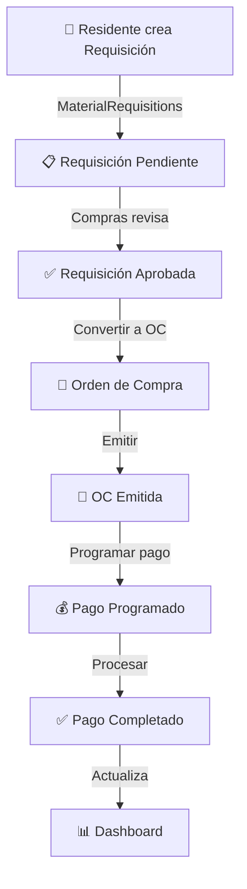
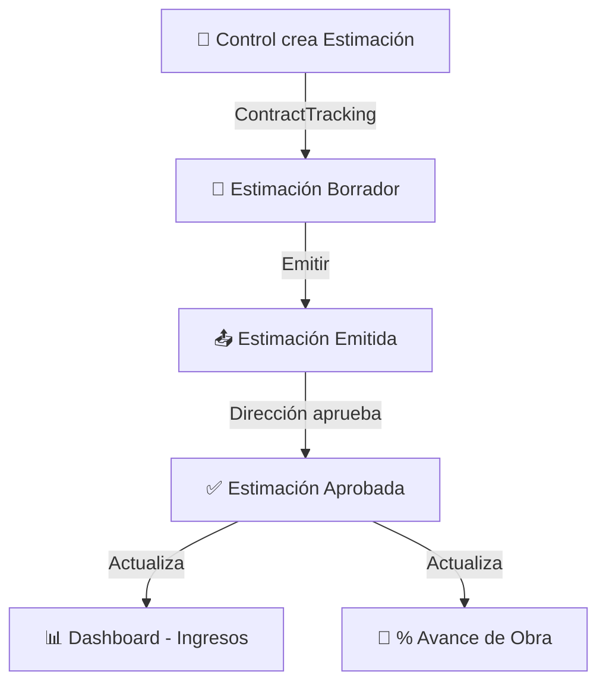

# ⚡ INICIO RÁPIDO - Sistema IDP

## 🎯 ¿Qué es esto?

Sistema **100% frontend** de gestión financiera para proyectos de construcción.

**Estado:** Listo para usar, transportar o integrar con cualquier backend.

---

## 🚀 Empezar en 3 Pasos

### 1️⃣ Instalar
```bash
npm install
```

### 2️⃣ Ejecutar
```bash
npm run dev
```

### 3️⃣ Abrir
```
http://localhost:5173
```

**¡Listo!** El sistema está funcionando con datos de ejemplo.

---

## 🗂️ Navegación de Documentación

### 📘 Para Usuarios del Sistema
**Archivo:** [DOCUMENTACION_SISTEMA.md](DOCUMENTACION_SISTEMA.md)

**Lee esto si quieres:**
- ✅ Entender cómo funciona cada módulo
- ✅ Conocer qué datos maneja el sistema
- ✅ Aprender los códigos y nomenclaturas
- ✅ Solucionar problemas comunes

**Secciones importantes:**
- Módulo 3 (Compras): Incluye gestión secreta de proveedores
- Módulo 6 (Seguimiento): Formulario único de movimientos
- Códigos y Nomenclaturas: Formato de números de OC, requisiciones, etc.

---

### 🔧 Para Desarrolladores / Integradores
**Archivo:** [GUIA_INTEGRACION.md](GUIA_INTEGRACION.md)

**Lee esto si quieres:**
- ✅ Integrar el sistema en tu proyecto existente
- ✅ Conectar con tu propio backend
- ✅ Separar en micro-frontends
- ✅ Personalizar estilos y logos
- ✅ Implementar autenticación
- ✅ Hacer deploy en producción

**Escenarios cubiertos:**
1. Usar como está (demo/prototipo)
2. Integrar en proyecto existente
3. Conectar con backend propio
4. Separar en micro-frontends (5 URLs diferentes)

---

### 📊 Para Análisis de Datos
**Archivo:** [MAPA_DATOS_MODULOS.md](MAPA_DATOS_MODULOS.md)

**Lee esto si quieres:**
- ✅ Saber qué datos usa cada módulo
- ✅ Entender los flujos de información
- ✅ Ver qué datos se calculan vs se almacenan
- ✅ Conocer las relaciones entre entidades

**Incluye:**
- Entrada/salida de datos por módulo
- Cálculos y fórmulas
- Flujos completos (ej: Requisición → OC → Pago)
- Tablas de referencia rápida

---

## 🎨 Características Visuales

### Tema Cálido Café/Amarillo
```
Fondo: Crema con textura de puntos
Colores: Tonos tierra y dorados
Contraste: Suave y profesional
```

### Componentes Modernos
- Cards con sombras suaves
- Badges de colores por estado
- Iconos de lucide-react
- Gráficas con recharts
- Modales y diálogos elegantes

---

## 🔐 Funciones Especiales

### 🕵️ Gestión Secreta de Proveedores

**¿Dónde?** Módulo de Compras

**¿Cómo activar?**
1. Ir a `/compras`
2. Hacer **5 clicks** en el icono azul del header (FileText)
3. Ingresar contraseña: **`admin123`**
4. ✨ Se abre el panel de gestión de proveedores

**Funcionalidades:**
- ➕ Agregar nuevos proveedores
- ✏️ Editar proveedores existentes
- 🗑️ Eliminar proveedores
- 📋 Ver tabla completa con todos los datos

**Datos del proveedor:**
```typescript
{
  proveedor: string,        // Nombre corto
  razonSocial: string,      // Razón social completa
  rfc: string,              // RFC (13 caracteres)
  direccion: string,        // Dirección completa
  vendedor: string,         // Por defecto "mostrador"
  telefono: string,
  correo: string            // Email validado
}
```

---

## 📦 Módulos del Sistema

### 1. 🏠 Home
**Ruta:** `/`

Portal de entrada con acceso a los 5 módulos principales.

---

### 2. 📊 Dashboard Global
**Ruta:** `/dashboard`

**Qué muestra:**
- Total de obras activas
- Monto contratado vs ejercido
- Saldo disponible por obra
- Gráficas de barras y circulares
- Indicadores de salud financiera

**Datos que consulta:**
- Todas las obras
- Órdenes de compra (para calcular gastos)
- Estimaciones (para calcular ingresos)

---

### 3. 🛒 Compras
**Ruta:** `/compras`

**Qué puedes hacer:**
- ➕ Crear órdenes de compra
- ✏️ Editar órdenes existentes
- 📄 Generar PDF de orden
- 🗑️ Eliminar órdenes
- 🔍 Buscar y filtrar
- 🕵️ **Gestionar proveedores (secreto)**

**Datos principales:**
```typescript
{
  numeroOrden: "227-A01GM-CEMEX",
  obra: "CASTELLO E",
  proveedor: "CEMEX",
  items: [...],
  total: 40078,
  estado: "Aprobada"
}
```

---

### 4. 📋 Requisiciones
**Ruta:** `/requisiciones`

**Qué puedes hacer:**
- ➕ Crear requisiciones de material
- 💬 Comentar y comunicarse con Compras
- ✅ Aprobar requisiciones (Compras)
- 🔄 Convertir a Orden de Compra
- 🔍 Filtrar por urgencia y estado

**Flujo:**
```
Residente → Crea Requisición
  ↓
Compras → Revisa y Comenta
  ↓
Compras → Aprueba
  ↓
Compras → Convierte a OC
```

---

### 5. 💰 Pagos
**Ruta:** `/pagos`

**Qué puedes hacer:**
- 📅 Programar pagos a proveedores
- 💳 Registrar método de pago
- ✅ Marcar pagos como completados
- 📊 Ver calendario semanal
- ⚠️ Ver alertas de vencidos

**Datos principales:**
```typescript
{
  numeroPago: "PAG-227-001",
  ordenCompra: "227-A01GM-CEMEX",
  proveedor: "CEMEX",
  monto: 40078,
  metodoPago: "Transferencia",
  fechaProgramada: "2025-02-01",
  estado: "Programado"
}
```

---

### 6. 📐 Seguimiento Físico
**Ruta:** `/seguimiento`

**🆕 Innovación: Formulario Único**

Un solo formulario maneja **3 tipos de movimientos:**
- 🔵 **Estimaciones** (avance de obra)
- 🟢 **Aditivas** (incremento de contrato)
- 🔴 **Deductivas** (reducción de contrato)

**Características:**
- Selector de tipo de movimiento
- Campos dinámicos según tipo
- Tabla consolidada con badges de colores
- Resumen financiero automático

**Datos calculados:**
```typescript
{
  montoOriginal: 15000000,
  estimacionesAcumuladas: 8500000,
  aditivasAcumuladas: 500000,
  deductivasAcumuladas: -150000,
  montoActualizado: 15350000,
  porcentajeAvance: 55.4%,
  saldoPorEjercer: 6850000
}
```

---

## 🔄 Flujos de Trabajo

### Flujo Completo: De Requisición a Pago



### Flujo de Estimación



---

## 💾 Persistencia de Datos

### ⚠️ IMPORTANTE: No hay persistencia real

**El sistema usa MockProvider:**
- Datos en memoria (RAM)
- Al recargar la página, se reinician
- Datos de ejemplo precargados

**Para persistencia real:**
1. Conecta un backend (ver [GUIA_INTEGRACION.md](GUIA_INTEGRACION.md))
2. Implementa ApiProvider
3. Usa PostgreSQL, MongoDB, etc.

---

## 🎨 Personalización Rápida

### Cambiar Nombre de Empresa

Buscar y reemplazar `"IDP"` en:
- `/src/app/Home.tsx`
- `/public/logo-idp-*.svg` (reemplazar archivos)

### Cambiar Colores

Editar `/src/styles/theme.css`:
```css
:root {
  --warm-500: #TU_COLOR_PRINCIPAL;
  --warm-600: #TU_COLOR_OSCURO;
  /* ... */
}
```

### Cambiar Logos

Reemplazar archivos en `/public/`:
- `logo-idp-normal.svg` → Logo horizontal
- `logo-idp-alterno.svg` → Logo alternativo
- `logo-idp.svg` → Icono/favicon

---

## 📤 Deploy Rápido

### Netlify (Recomendado)

1. Conecta tu repositorio
2. Build command: `npm run build`
3. Publish directory: `dist`
4. **No requiere variables de entorno**
5. ¡Deploy automático!

### Vercel

Igual que Netlify, muy sencillo.

### Render (Static Site)

```yaml
buildCommand: npm install && npm run build
publishPath: ./dist
```

---

## 🧪 Datos de Prueba Incluidos

### Obras
- 227 - CASTELLO E
- 228 - CASTELLO F
- 229 - CASTELLO G
- 231 - DOZA A
- 232 - BALVANERA

### Proveedores
- CEMEX
- LEVINSON
- HOME DEPOT
- INTERCERAMIC
- BEREL
- HIERROS

### Órdenes de Compra
6 OCs de ejemplo con diferentes estados

### Requisiciones
5 requisiciones con diferentes urgencias

### Pagos
Varios pagos programados y completados

---

## 🆘 Ayuda Rápida

### No veo el botón de gestión de proveedores
➡️ Es **secreto**. Haz 5 clicks en el icono azul.

### Los datos desaparecen al recargar
➡️ **Normal**. Es MockProvider. Para persistencia, conecta backend.

### Error al generar PDF
➡️ Verifica que todos los campos estén completos.

### ¿Cómo conecto un backend?
➡️ Lee [GUIA_INTEGRACION.md](GUIA_INTEGRACION.md) sección "Escenario 3".

### ¿Puedo usar solo un módulo?
➡️ Sí. Lee [GUIA_INTEGRACION.md](GUIA_INTEGRACION.md) sección "Opción B".

---

## 📚 Siguiente Paso

**Para usuarios del sistema:**
→ Lee [DOCUMENTACION_SISTEMA.md](DOCUMENTACION_SISTEMA.md)

**Para desarrolladores:**
→ Lee [GUIA_INTEGRACION.md](GUIA_INTEGRACION.md)

**Para analistas de datos:**
→ Lee [MAPA_DATOS_MODULOS.md](MAPA_DATOS_MODULOS.md)

---

## 📞 Información del Sistema

```
Empresa: IDP
Sistema: Gestión Financiera y Seguimiento de Proyectos
Versión: 2.0 (Frontend Puro)
Estado: Producción - Transportable
Última actualización: Enero 2025
```

---

**¡Disfruta usando el Sistema IDP! 🏗️✨**
